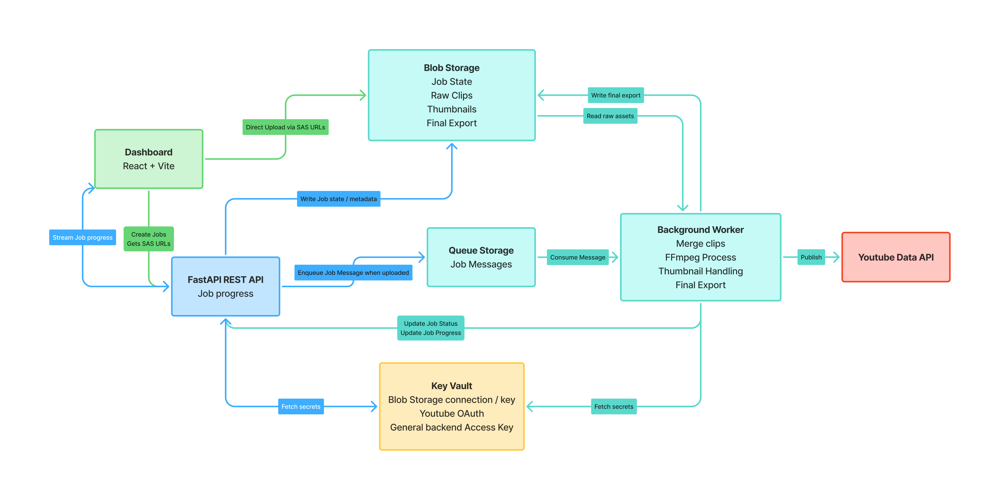

# # Automated Media Publisher

A cloud-native media publishing pipeline that automates video upload, post-processing, and publishing workflows.

## Overview

Automated Media Publisher is a full-stack system for creating media publishing jobs, uploading video assets, and asynchronously processing content for final distribution.

The platform is designed around a decoupled architecture using a frontend dashboard, REST API backend, and a worker-based processing pipeline.

Current architecture diagram:

---

## Stack

### Frontend
- React
- Vite
- TypeScript
- Tailwind CSS
- shadcn/ui

The frontend dashboard is currently deployed on Vercel.

Features include:
- create publishing jobs
- upload clips and thumbnails
- track upload progress
- refresh and monitor job status

---

## Backend API
- FastAPI
- Docker
- Azure Blob Storage (planned / in progress)
- Azure Queue Storage (planned / in progress)

The backend handles:
- job creation
- asset registration
- status retrieval
- orchestration endpoints for processing

The FastAPI app runs in Docker.

---

## Worker
WORK IN PROGRESS

The background worker is currently being implemented.

Planned responsibilities:
- consume queued processing jobs
- merge uploaded video clips
- run FFmpeg post-processing
- generate final media output
- publish to YouTube
- update job status

Planned deployment target:
- Azure Container Apps worker
- queue-triggered processing

---

## Deployment

### Frontend
- Hosted on Vercel

### Backend
- Containerized FastAPI service
- Docker-based deployment
- planned Azure Container Apps deployment

---

## Project Status

Currently in active development.

### Completed
- frontend dashboard
- job workflow UI
- FastAPI backend scaffolding
- Dockerized API service

### In Progress
- worker pipeline
- queue orchestration
- cloud storage integration
- automated publishing flow

## Deployment / Run Commands

### Run FastAPI locally with Docker

Build the Docker image:

docker build -t auto-media-api .

Run the container locally:

docker run -p 8000:8000 auto-media-api

The API will be available at:
http://localhost:8000

Interactive docs:
http://localhost:8000/docs

### Deploy to Azure Container Apps

Build and tag image:

docker build -t auto-media-api .

Tag for Azure Container Registry:

docker tag auto-media-api <acr-name>.azurecr.io/auto-media-api:latest

Push image to ACR:

docker push <acr-name>.azurecr.io/auto-media-api:latest

Deploy to Azure Container Apps:

az containerapp up \
  --name auto-media-api \
  --resource-group <resource-group> \
  --location canadacentral \
  --environment <container-app-env> \
  --image <acr-name>.azurecr.io/auto-media-api:latest \
  --target-port 8000 \
  --ingress external

Update an existing deployment:

az containerapp update \
  --name auto-media-api \
  --resource-group <resource-group> \
  --image <acr-name>.azurecr.io/auto-media-api:latest