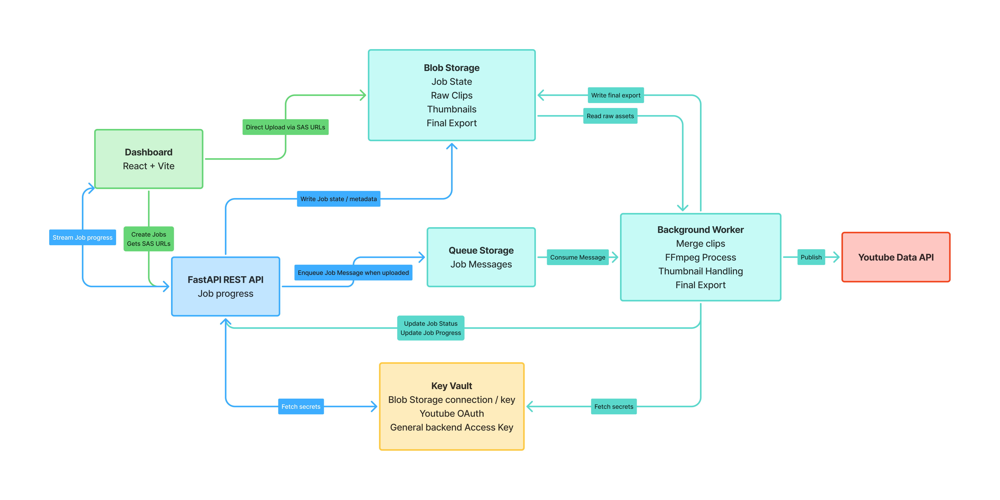

## Automated Media Publisher

A cloud-native media publishing pipeline that automates video upload, post-processing, and publishing workflows.

## Overview

Automated Media Publisher is a full-stack system for creating media publishing jobs, uploading video assets, and asynchronously processing content for final distribution.

The platform is designed around a decoupled architecture using a frontend dashboard, REST API backend, and a worker-based processing pipeline.

Current architecture diagram for the cloud implementation:

---

## Desktop

AMP also includes a cross-platform desktop app built with Electron, React, and a Python worker.

The desktop app is designed for local video publishing workflows where users select video clips, optionally add a thumbnail, render the final output with FFmpeg, and upload directly to YouTube.

### Desktop Features

- select multiple local video clips
- select a custom thumbnail
- render and merge clips with FFmpeg
- choose render/upload mode or upload an existing render
- connect to YouTube using local Google OAuth credentials
- list and select YouTube playlists
- upload videos with privacy settings
- view render and upload progress
- cancel active jobs
- open local logs and rendered output files

### Desktop Stack

- Electron
- React
- Vite
- TypeScript
- Python
- FFmpeg / FFprobe
- PyInstaller
- electron-builder
- GitHub Actions releases

### Platform Support

- Windows: supported
- macOS: experimental
- Linux: not officially tested

macOS builds are supported through platform-aware worker binaries and FFmpeg path handling. Unsigned macOS builds may require right-clicking the app and selecting **Open** on first launch.

### Credentials

AMP does not ship with Google credentials.

To upload to YouTube, users must import their own Google OAuth credentials JSON. AMP stores credentials and tokens locally in the app data directory.

## Cloud Implementation

### Frontend

- React
- Vite
- TypeScript
- Tailwind CSS
- shadcn/ui

The frontend dashboard is currently deployed on Vercel.

Features include:

- create publishing jobs
- upload clips and thumbnails
- track upload progress
- refresh and monitor job status

---

## Backend API

- FastAPI
- Docker
- Azure Blob Storage
- Azure Queue Storage

The backend handles:

- job creation
- asset registration
- status retrieval
- orchestration endpoints for processing

The FastAPI app runs in Docker.

---

## Worker

- consumes queued processing jobs
- merges uploaded video clips
- runs FFmpeg post-processing
- generates final media output
- publishes to YouTube
- updates job status

Deployment target:

- Azure Container Apps worker
- queue-triggered processing

---

## Deployment

### Frontend

- Hosted on Vercel

### Backend

- Containerized FastAPI service
- Docker-based deployment
- Deployed via Azure Container Apps

### Worker

- Deployed via Azure Container Apps wor

---

## Project Status

Currently in active development.

### Completed

- frontend dashboard
- job workflow UI
- FastAPI backend scaffolding
- Dockerized API service
- worker pipeline
- queue orchestration
- cloud storage integration
- automated publishing flow

### In Progress

- CI/CD deployment to Azure via GitHub actions
- Email alerts

## Deployment / Run Commands

### Run FastAPI locally with Docker

Build the Docker image:

docker build -t auto-media-api .

Run the container locally:

docker run -p 8000:8000 auto-media-api

The API will be available at:
http://localhost:8000

Interactive docs:
http://localhost:8000/docs

### Deploy to Azure Container Apps

Build and tag image:

docker build -t auto-media-api .

Tag for Azure Container Registry:

docker tag auto-media-api <acr-name>.azurecr.io/auto-media-api:latest

Push image to ACR:

docker push <acr-name>.azurecr.io/auto-media-api:latest

Deploy to Azure Container Apps:

az containerapp up \
 --name auto-media-api \
 --resource-group <resource-group> \
 --location canadacentral \
 --environment <container-app-env> \
 --image <acr-name>.azurecr.io/auto-media-api:latest \
 --target-port 8000 \
 --ingress external

Update an existing deployment:

az containerapp update \
 --name auto-media-api \
 --resource-group <resource-group> \
 --image <acr-name>.azurecr.io/auto-media-api:latest
